<div align="center">
    
</div>

# Proyecto de Visualización de Datos con Herramientas Básicas

## 📋 Información General

<div align="center">
    
</div>

| Aspecto | Detalles |
|--------|----------|
| **Autor** | Andrés Giovanny Rubiano Muñoz "Andy Rubiano" |
| **Correo** | arubiano67@unisalle.edu.co |
| **Asignatura** | Ciencia de Datos — Actividad 3 |
| **Programa** | Maestría en Inteligencia Artificial |
| **Universidad** | Universidad de La Salle |
| **Herramientas** | Python 3.14 (Matplotlib · pandas · seaborn · Plotly) y R 4.6 (graficación base · ggplot2) |
| **Año** | 2026 |
| **Estado** | Completado |

---

## 🎯 Descripción del Proyecto

Laboratorio de **estadística descriptiva y visualización comparada** sobre un conjunto de datos simulado de consumo energético mensual de **120 clientes** de una empresa distribuidora (sectores Residencial, Comercial e Industrial). La semilla fija `default_rng(42)` reproduce exactamente las mismas 120 observaciones de las actividades anteriores, de modo que el foco puede ponerse en lo que esta actividad añade y no en volver a describir los datos.

El proyecto responde a dos preguntas encadenadas:

1. **¿Qué dicen los datos?** Exploración y manipulación con **pandas** (perfilado, variables derivadas, `groupby`, `pivot_table`) y estadística descriptiva completa: distribución de frecuencias por la **regla de Sturges**, medidas de **tendencia central**, de **dispersión** y de **forma**, cada una traducida a su gráfico correspondiente.
2. **¿Con qué herramienta conviene dibujarlos?** Comparación medida de **seis herramientas** (Matplotlib, pandas.plot, seaborn, Plotly, R base y ggplot2) construyendo *el mismo gráfico* en todas y midiendo líneas de código, tiempo de renderizado y peso del archivo.

Todo el análisis estadístico se **verifica de forma cruzada en R**, que recalcula cada cifra de manera independiente.

### Objetivos Principales

- Explorar y manipular el conjunto de datos con pandas antes de graficarlo.
- Construir la distribución de frecuencias e interpretar las medidas de tendencia central, dispersión y forma.
- Aplicar los principios de visualización a todas las figuras: título informativo, ejes con unidad, escala desde cero, cuadrícula sutil detrás de los datos, color funcional y etiquetas de dato.
- Comparar herramientas de visualización con indicadores medidos y justificar, con esa evidencia, la elección de Matplotlib para este laboratorio.
- Validar todo el cálculo mediante una implementación independiente en R.

---

## 📚 Estructura del Repositorio

```
.
├── README.md                                     # Este archivo
├── requirements.txt                              # Dependencias de Python
├── .gitignore                                    # Excluye venv/, __pycache__/, .Rhistory, .vscode/
├── data/
│   ├── dataset/
│   │   └── consumo_energia.csv                   # Dataset generado (semilla 42, reproducible)
│   └── processed/
│       ├── perfil_datos.csv                      # Tipos, nulos y cardinalidad por columna
│       ├── resumen_por_sector.csv                # Agregados de groupby().agg()
│       ├── tabla_dinamica_sector_rango.csv       # Cruce sector × rango de consumo
│       ├── top10_consumo.csv                     # Diez mayores consumidores
│       ├── freq_table.csv                        # Distribución de frecuencias: fi, Fi, hi %, Hi %
│       ├── central_tendency.csv                  # Media, mediana y moda interpolada
│       ├── dispersion.csv                        # Rango, varianza, σ, CV, IQR, asimetría, curtosis
│       ├── comparativa_herramientas.csv          # Cuatro herramientas de Python medidas
│       ├── comparativa_herramientas_r.csv        # R base y ggplot2 medidos
│       └── comparativa_consolidada.csv           # Las seis herramientas en una sola tabla
├── public/
│   └── assets/
│       └── images/
│           ├── Logo.png                          # Logo institucional
│           ├── author/                           # Foto del autor
│           └── figures/
│               ├── python/
│               │   ├── statistics/               # 5 figuras estadísticas (Matplotlib)
│               │   └── tools/                    # 4 gráficos comparados + 2 resúmenes + HTML interactivo
│               └── r/
│                   ├── statistics/               # 2 réplicas en R base
│                   └── tools/                    # R base y ggplot2 sobre el mismo gráfico
└── utils/
    └── codes/
        ├── exploration.py                        # Fase 1 · dataset y exploración con pandas
        ├── descriptive_stats.py                  # Fase 2 · estadística descriptiva y figuras
        ├── descriptive_stats.R                   # Fase 3 · verificación cruzada en R
        ├── benchmark.R                           # Fase 4 · R base frente a ggplot2
        └── benchmark.py                          # Fase 5 · comparación de herramientas y consolidado
```

---

## 🧪 Pipeline del Laboratorio

El flujo es **secuencial**: la Fase 1 crea el dataset que consumen todas las demás, y la Fase 5 cierra el circuito uniendo sus mediciones con las de R.

| Fase | Script | Qué produce |
|---|---|---|
| 1 | [`exploration.py`](utils/codes/exploration.py) | Dataset y cuatro tablas de exploración con pandas |
| 2 | [`descriptive_stats.py`](utils/codes/descriptive_stats.py) | Frecuencias, tendencia central, dispersión y 5 figuras |
| 3 | [`descriptive_stats.R`](utils/codes/descriptive_stats.R) | Recálculo independiente en R y 2 réplicas gráficas |
| 4 | [`benchmark.R`](utils/codes/benchmark.R) | Medición de R base y ggplot2 |
| 5 | [`benchmark.py`](utils/codes/benchmark.py) | Medición de las 4 herramientas de Python y consolidado de las 6 |

**Características clave:**

- **Reproducibilidad:** semilla fija (`default_rng(42)`); cualquier ejecución produce las mismas 120 observaciones y las mismas tablas.
- **Comparación honesta:** las seis implementaciones dibujan la *misma* especificación gráfica —título, ejes rotulados, etiquetas de dato, misma paleta, cuadrícula sutil sobre el eje de magnitudes y mismo tamaño en píxeles— y se cronometran con una pasada de calentamiento más cinco medidas, de las que se reporta la mediana.
- **Estilo idiomático:** cada herramienta se escribe como su comunidad la escribe. Redactarlas todas al estilo de Matplotlib habría falseado el conteo de líneas de código.
- **Verificación cruzada:** R recalcula las ocho clases de Sturges, la moda interpolada y todos los estadísticos —incluidas asimetría y curtosis con la misma corrección muestral— y coincide **dígito a dígito** con las tablas de Python.
- **Rutas:** Python resuelve las suyas desde la ubicación del script (`Path(__file__)`); R usa rutas relativas a la raíz del proyecto, así que debe ejecutarse desde ahí.

---

## ⚙️ Requisitos

### Python

> ⚠️ **Versión:** Python 3.10 o superior (probado en **3.14.7**), con entorno virtual dedicado (`venv/`).

| Dependencia | Versión probada | Uso |
|---|---|---|
| `numpy` | 2.5.2 | Generación del dataset, histogramas y cálculo numérico |
| `pandas` | 3.0.5 | Exploración, tablas estadísticas y manejo del CSV |
| `matplotlib` | 3.11.1 | Todas las figuras del laboratorio |
| `seaborn` | 0.13.2 | Solo para la comparación de herramientas |
| `plotly` | 6.9.0 | Solo para la comparación de herramientas |
| `kaleido` | 1.3.0 | Motor que exporta las figuras de Plotly a PNG |

El resto de entradas de [`requirements.txt`](requirements.txt) son dependencias transitivas.

### R

- **R 4.x** (probado en 4.6.1), con **ggplot2 4.0.3** para la fase comparativa: `install.packages("ggplot2")`.
- Los dispositivos PNG se abren con `type = "cairo"` para obtener texto antialiasado.
- Editor: RStudio Desktop o VS Code con la extensión **R** (REditorSupport) + `languageserver`.

---

## 🛠️ Ejecución

> Todos los comandos se lanzan **desde la raíz del proyecto**, porque los scripts de R resuelven sus rutas de forma relativa.

```bash
# 1. Entorno de Python
py -3.14 -m venv venv           # o `python -m venv venv` si 3.14 ya es el intérprete por defecto
source venv/Scripts/activate    # Git Bash (en PowerShell: venv\Scripts\activate)
pip install -r requirements.txt

# 2. Fases 1 y 2: datos y estadística descriptiva
python utils/codes/exploration.py
python utils/codes/descriptive_stats.py

# 3. Fases 3 y 4: verificación cruzada y medición en R
Rscript utils/codes/descriptive_stats.R
Rscript utils/codes/benchmark.R

# 4. Fase 5: comparación de herramientas y consolidado final
python utils/codes/benchmark.py
```

Si `Rscript` no está en el `PATH` de Git Bash, añádelo a la sesión antes del paso 3:

```bash
export PATH="/c/Program Files/R/R-4.6.1/bin/x64:$PATH"
```

> ℹ️ La Fase 5 debe ejecutarse **después** de la Fase 4: es la que une las mediciones de ambos lenguajes en `comparativa_consolidada.csv`. Si se corre antes, avisa por consola y genera solo el comparativo de Python.

---

## 🎨 Principios de Visualización Aplicados

Todas las figuras del laboratorio —las de Python, las de R y las seis de la comparación— cumplen la misma especificación, derivada de que el ojo compara posiciones y longitudes con mucha más precisión que áreas, ángulos o intensidades de color:

| Principio | Cómo se aplica |
|---|---|
| **Título informativo** | Enuncia el hallazgo, no solo el nombre de la variable |
| **Ejes rotulados con unidad** | La figura se entiende sin leer el texto que la acompaña |
| **Escala desde cero** | La altura de cada barra es proporcional a la cantidad que representa |
| **Cuadrícula sutil y detrás** | `axes.axisbelow`, α = 0,3 y solo sobre el eje de magnitudes: ayuda a leer valores sin competir con los datos |
| **Color funcional** | Distingue categorías o resalta una medida; nunca decora |
| **Etiquetas de dato** | Evitan al lector estimar valores a ojo |

En las barras horizontales la cuadrícula se traslada al eje X y el orden se invierte, de modo que el mejor valor quede arriba, donde se lee primero.

---

## 🐼 Fase 1 · Exploración y manipulación con pandas

Antes de calcular nada, pandas responde qué hay en el archivo. El perfilado confirma **120 registros sin nulos ni duplicados**, y `describe()` ya anticipa el hallazgo central: la media del consumo (819,1 kWh) más que duplica la mediana (378,6 kWh).

Dos operaciones concentran el trabajo de manipulación:

| Operación | Para qué |
|---|---|
| `df["tarifa_cop_kwh"] = df["costo_miles_cop"] * 1000 / df["consumo_kwh"]` | Recupera el precio implícito de cada factura |
| `pd.cut(...)` sobre `consumo_kwh` | Discretiza la variable continua en cuatro rangos ordenados |

**Resumen por sector** (`groupby().agg()`):

| Sector | Clientes | % clientes | Consumo medio (kWh) | Consumo total (kWh) | % del consumo | Tarifa media (COP/kWh) |
|---|---|---|---|---|---|---|
| Residencial | 62 | 51,7 | 248,3 | 15 396,4 | 15,7 | 821,8 |
| Comercial | 40 | 33,3 | 878,1 | 35 125,3 | 35,7 | 710,4 |
| Industrial | 18 | 15,0 | 2 654,0 | 47 771,5 | 48,6 | 645,0 |

El sector Industrial es **15 % de los clientes y casi la mitad de la energía**, con la tarifa más baja: la asimetría del negocio está en los datos antes que en cualquier gráfico. La tabla dinámica lo confirma —cada sector ocupa su propia franja de consumo, con solo dos clientes comerciales solapándose en el rango bajo— y los diez mayores consumidores (8,3 % de la base) concentran el **32,1 %** del consumo total.

---

## 🖼️ Galería de Figuras

### Distribución de frecuencias y tendencia central (Python · Matplotlib)

| | |
|---|---|
| 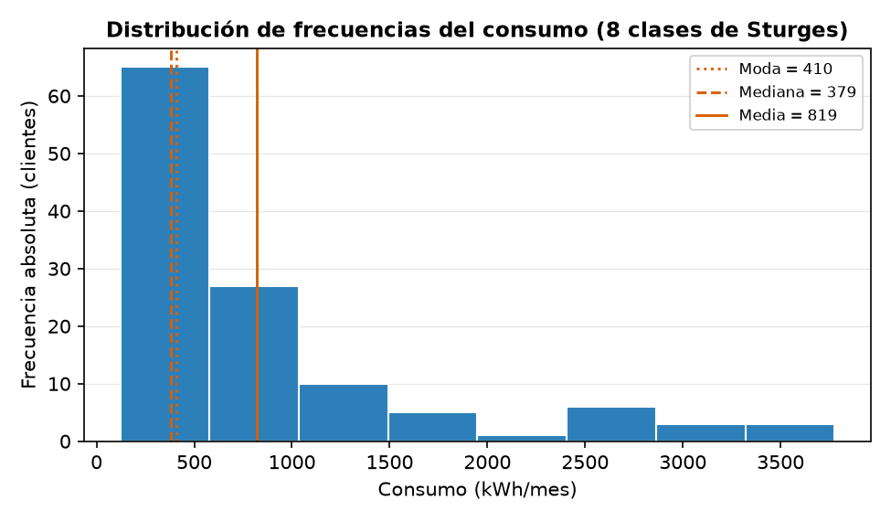 | 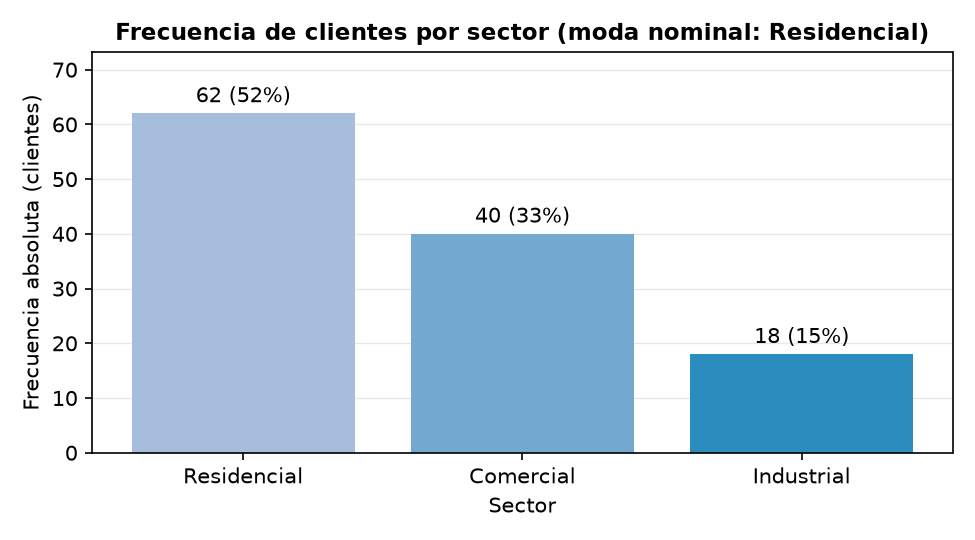 |
| **Histograma de Sturges** — 8 clases con moda, mediana y media superpuestas: moda y mediana caen juntas en la primera clase mientras la media se desplaza a la derecha | **Barras de frecuencia** — distribución de la variable nominal, ordenada por magnitud y etiquetada con n (%) |

<div align="center">
    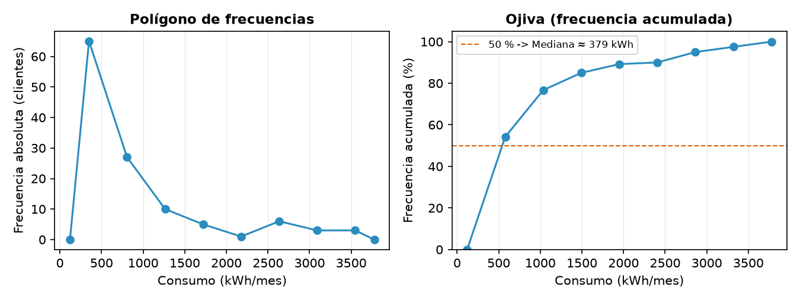
</div>

**Polígono de frecuencias y ojiva** — dos lecturas de la misma tabla: la puntual (marca de clase vs. fi) y la acumulada (límite superior vs. Hi %), donde el corte con el 50 % localiza gráficamente la mediana. Son las dos únicas figuras con cuadrícula en ambos ejes, porque aquí el eje X sí es continuo.

### Dispersión y comparación entre sectores (Python · Matplotlib)

| | |
|---|---|
| 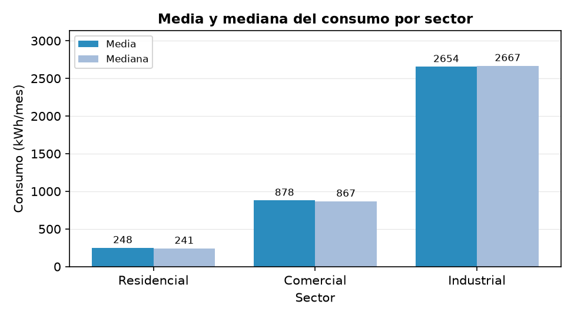 | 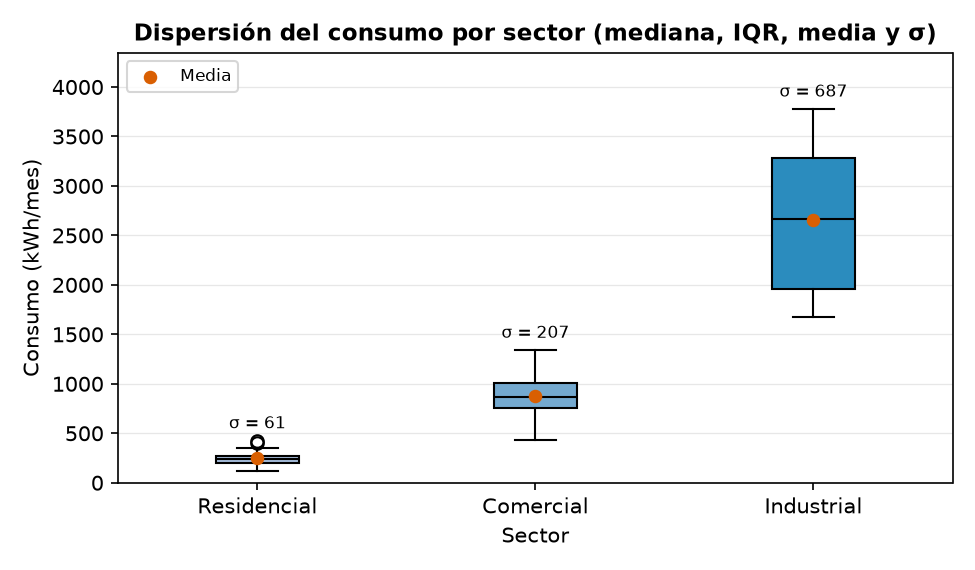 |
| **Barras agrupadas media vs. mediana** — su cercanía dentro de cada sector revela simetría local pese a la asimetría global | **Diagrama de caja con media y σ** — posición (mediana), dispersión (IQR y bigotes) y su relación con la desviación estándar |

### Réplica en R (graficación base)

R recalcula todos los estadísticos de forma independiente y replica las dos figuras que sostienen el análisis. La cuadrícula se traza en **dos pasadas** —marco sin relleno, cuadrícula, barras encima— porque la graficación base no tiene un equivalente a `axisbelow`.

| | |
|---|---|
| 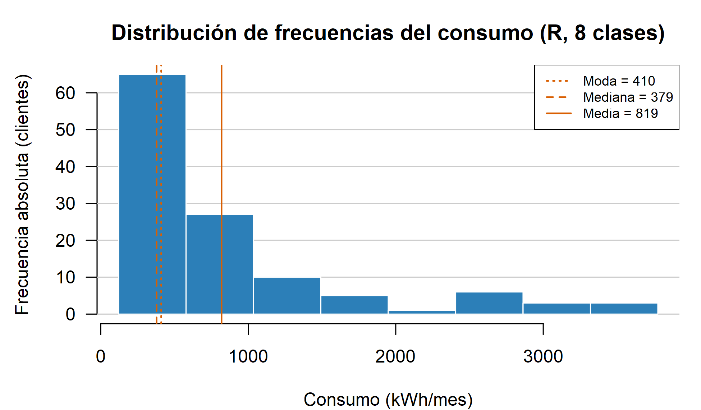 | 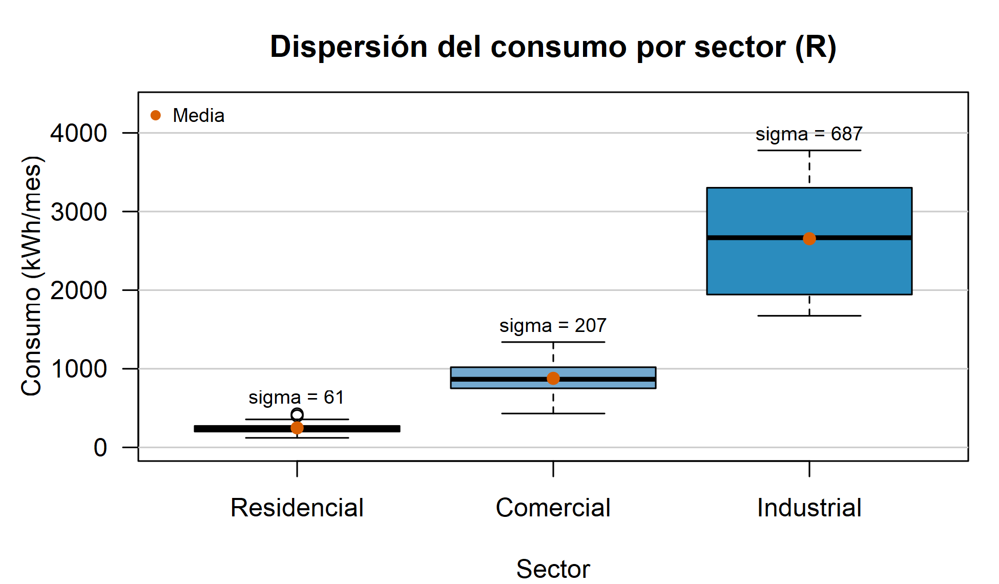 |
| **Histograma de Sturges** — mismas 8 clases y mismas medidas de posición | **Dispersión por sector** — caja, media y σ |

---

## ⚖️ Comparación de Herramientas de Visualización

Las seis herramientas dibujan **el mismo gráfico**: consumo medio por sector, con título, ejes rotulados, etiquetas de dato, cuadrícula sutil y la misma paleta, a 975 × 555 px. Fijar la especificación es lo que permite atribuir las diferencias a la herramienta y no al gráfico.

| | |
|---|---|
| 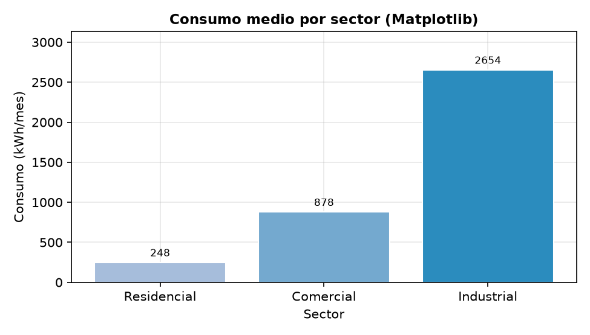 | 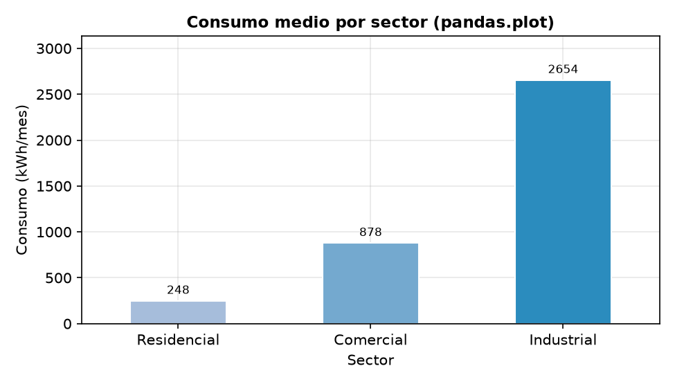 |
| **Matplotlib** — cada elemento se declara explícitamente | **pandas.plot** — el gráfico sale del propio DataFrame |
| 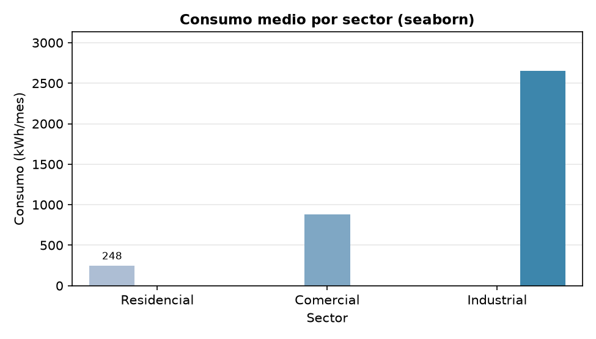 | 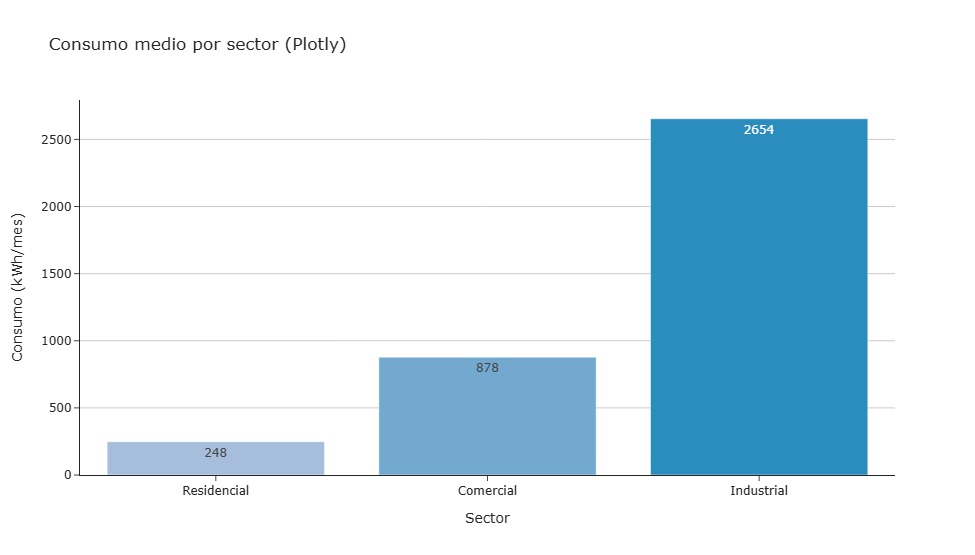 |
| **seaborn** — agrega la media por sector sin que se le pida | **Plotly** — mete las etiquetas dentro de la barra y necesita declarar la cuadrícula a mano |
| 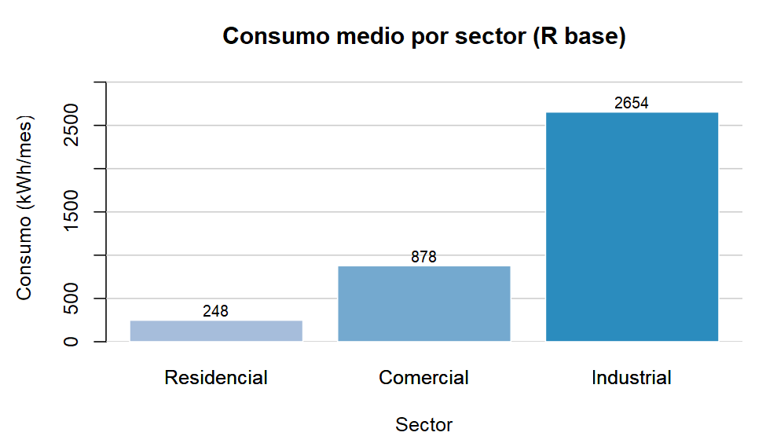 | 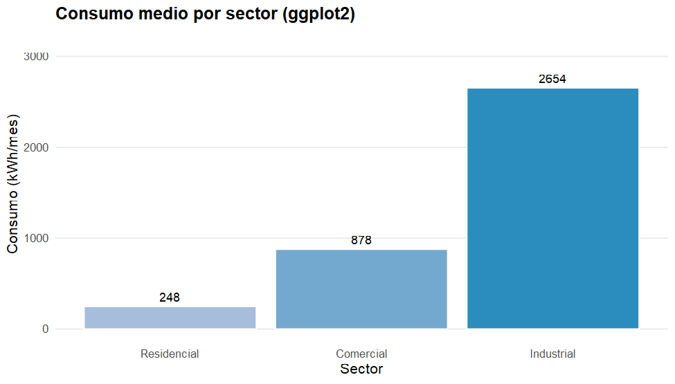 |
| **R base** — dibujo por pasos; la cuadrícula cuesta una pasada extra | **ggplot2** — el gráfico se declara como suma de capas |

### Resultados medidos

| Ecosistema | Herramienta | Versión | Paradigma | Motor de render | Interactivo | Líneas | Tiempo (ms) | Peso (KB) |
|---|---|---|---|---|---|---|---|---|
| Python | **Matplotlib** | 3.11.1 | Imperativa (orientada a objetos) | Agg / propio | No | 10 | 78,2 | 29,4 |
| Python | pandas.plot | 3.0.5 | Imperativa (método del DataFrame) | Matplotlib | No | 9 | 82,9 | 29,6 |
| Python | seaborn | 0.13.2 | Declarativa (gramática estadística) | Matplotlib | No | 9 | 84,3 | 27,2 |
| Python | Plotly | 6.9.0 | Declarativa (Plotly Express) | JavaScript (D3) / Kaleido | **Sí** | **7** | 1 807,7 | 26,5 |
| R | R base (graphics) | 4.6.1 | Imperativa (dibujo por pasos) | grDevices / Cairo | No | 8 | **12,4** | 11,1 |
| R | ggplot2 | 4.0.3 | Declarativa (gramática de gráficos) | grid / Cairo | No | 13 | 153,2 | 8,8 |

<div align="center">
    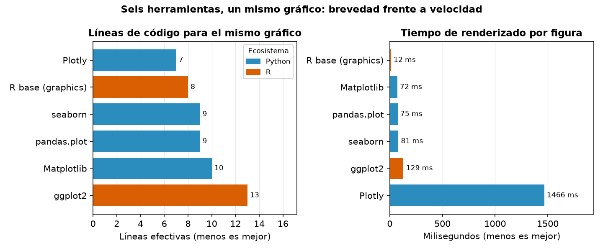
</div>

> Los tiempos entre lenguajes son **indicativos**: cada uno mide su propio entorno de ejecución, no un mismo motor. Dentro de un mismo lenguaje sí son directamente comparables.

### Lectura de los resultados

- **Brevedad y velocidad no van juntas.** Plotly escribe el gráfico en **7 líneas** —las menos de las seis— pero tarda **1 808 ms** en exportarlo a PNG: su motor real es JavaScript y necesita un navegador (Kaleido) para producir una imagen estática. Es **23 veces más lento** que Matplotlib para el mismo resultado.
- **pandas y seaborn no son alternativas a Matplotlib, son fachadas suyas.** Ambos renderizan *con* Matplotlib; su ventaja es escribir menos, y su costo, un tiempo ligeramente mayor y menos control sobre el detalle fino. Se nota en la cuadrícula: la heredan gratis de los `rcParams`, mientras que Plotly y R base tienen que declararla.
- **R base es el más rápido de los seis** (12,4 ms) y produce archivos casi tres veces más livianos, pero cada elemento —cuadrícula, etiquetas, límites— se ajusta a mano; de hecho es la única herramienta que necesita dibujar el gráfico dos veces para que la cuadrícula quede detrás de los datos.
- **La interactividad es la única ventaja que no se mide en segundos.** Plotly es el único que entrega un gráfico navegable ([`bar_plotly_interactivo.html`](public/assets/images/figures/python/tools/bar_plotly_interactivo.html)), y ese, no la brevedad, es su argumento frente a Matplotlib.

### Justificación de la elección

Este laboratorio produce **figuras estáticas de alta densidad informativa para un informe impreso**, y bajo ese requisito se eligió **Matplotlib**:

1. **Control total sobre la anotación.** Superponer media, mediana y moda en un histograma, o rotular σ sobre un diagrama de caja, exige alcanzar artistas individuales. Las fachadas declarativas facilitan el gráfico típico y estorban en el atípico, y casi todas las figuras de este laboratorio son atípicas.
2. **Costo bajo y predecible.** 78 ms por figura y ningún motor externo; Plotly requiere un navegador instalado, lo que rompe la reproducibilidad del laboratorio.
3. **Una capa de estilo reutilizable.** Un único bloque de `rcParams` impone los principios de visualización a todas las figuras a la vez —y de paso a las de pandas y seaborn—, en lugar de repetir los ajustes gráfico por gráfico.
4. **Es el sustrato común.** Elegir Matplotlib no descarta pandas ni seaborn: ambos siguen disponibles porque terminan devolviendo un objeto `Axes` que se puede seguir refinando con la API de Matplotlib.
5. **Paridad con R.** La graficación base de R replica cualquier figura de Matplotlib sin dependencias adicionales, lo que hace posible la verificación cruzada.

Las herramientas descartadas **no son peores, son para otro problema**: Plotly gana en tableros web, seaborn en exploración estadística rápida y ggplot2 en composiciones por capas dentro de R. Fuera del código, **Power BI y Tableau** resolverían la distribución del resultado a usuarios de negocio, pero no la reproducibilidad ni el control de versiones que exige un laboratorio académico.

---

## 📊 Resultados Estadísticos

### Distribución de frecuencias (regla de Sturges, k = 8, amplitud 457,0 kWh)

| Clase | Límites (kWh) | Marca | fi | Fi | hi (%) | Hi (%) |
|---|---|---|---|---|---|---|
| 1 | 121,2 – 578,2 | 349,7 | 65 | 65 | 54,2 | 54,2 |
| 2 | 578,2 – 1 035,2 | 806,7 | 27 | 92 | 22,5 | 76,7 |
| 3 | 1 035,2 – 1 492,2 | 1 263,7 | 10 | 102 | 8,3 | 85,0 |
| 4 | 1 492,2 – 1 949,2 | 1 720,7 | 5 | 107 | 4,2 | 89,2 |
| 5 | 1 949,2 – 2 406,1 | 2 177,6 | 1 | 108 | 0,8 | 90,0 |
| 6 | 2 406,1 – 2 863,1 | 2 634,6 | 6 | 114 | 5,0 | 95,0 |
| 7 | 2 863,1 – 3 320,1 | 3 091,6 | 3 | 117 | 2,5 | 97,5 |
| 8 | 3 320,1 – 3 777,1 | 3 548,6 | 3 | 120 | 2,5 | 100,0 |

La primera clase concentra el **54,2 %** de los clientes y el 76,7 % acumulado está por debajo de 1 035 kWh: la cola derecha es larga pero poco poblada.

### Tendencia central, dispersión y forma del consumo (kWh/mes)

| Grupo | n | Media | Mediana | Moda interp. | Rango | Varianza | Desv. est. | CV (%) | IQR | Asimetría | Curtosis |
|---|---|---|---|---|---|---|---|---|---|---|---|
| Residencial | 62 | 248,3 | 240,6 | 232,7 | 303,6 | 3 736,3 | 61,1 | 24,6 | 69,5 | 0,63 | 0,46 |
| Comercial | 40 | 878,1 | 866,6 | 787,8 | 908,4 | 42 989,5 | 207,3 | 23,6 | 255,3 | 0,02 | −0,18 |
| Industrial | 18 | 2 654,0 | 2 666,8 | 1 849,3 | 2 103,1 | 471 785,8 | 686,9 | 25,9 | 1 322,8 | 0,14 | −1,30 |
| **Global** | **120** | **819,1** | **378,6** | **409,6** | **3 655,9** | **763 564,7** | **873,8** | **106,7** | **742,0** | **1,85** | **2,75** |

- **Moda de la variable nominal `sector`: Residencial** (62 de 120 clientes, 52 %).
- **Asimetría positiva marcada a nivel global:** la moda interpolada (409,6) y la mediana (378,6) caen ambas dentro de la primera clase, mientras la media (819,1) se desplaza hacia la cola derecha. El coeficiente de asimetría (**1,85**) pone número a lo que el histograma muestra: la media global **no representa a ningún cliente típico**; la mediana es el resumen honesto.
- **La heterogeneidad es entre sectores, no dentro de ellos:** el CV global (**106,7 %**) cuadruplica el de cualquier sector individual (23,6 %–25,9 %). Lo que dispara la dispersión total es la diferencia de **escala** entre grupos (248 → 878 → 2 654 kWh), no la variabilidad interna.
- **Simetría local:** dentro de cada sector la media y la mediana difieren menos del 4 %, y sus asimetrías son casi nulas (0,63, 0,02 y 0,14), coherente con la generación normal por grupo.
- **Verificación cruzada:** Python y R producen las mismas 8 clases, las mismas frecuencias y los mismos estadísticos **dígito a dígito**, incluidas asimetría y curtosis.

---

## 🔑 Palabras Clave

`Visualización de Datos` · `Matplotlib` · `pandas` · `seaborn` · `Plotly` · `ggplot2` · `R` · `Estadística Descriptiva` · `Regla de Sturges` · `Comparación de Herramientas` · `Principios de Visualización` · `Ciencia de Datos` · `Python`

---

## 📧 Contacto

**Andrés Giovanny Rubiano Muñoz**
Maestría en Inteligencia Artificial · Universidad de La Salle
arubiano67@unisalle.edu.co

---

## 📄 Derechos Reservados

© 2026 Andrés Giovanny Rubiano Muñoz (Andy Rubiano). Todos los derechos reservados.

Este laboratorio y su contenido —código, datos y documentación— son propiedad intelectual conjunta de:

- **Andrés Giovanny Rubiano Muñoz** (Andy Rubiano) — Autor
- **Universidad de La Salle** — Institución académica

El uso, reproducción o distribución requiere autorización previa escrita de los titulares de derechos.

---

<div align="center">
  Universidad de La Salle | Bogotá D. C., Colombia
</div>
